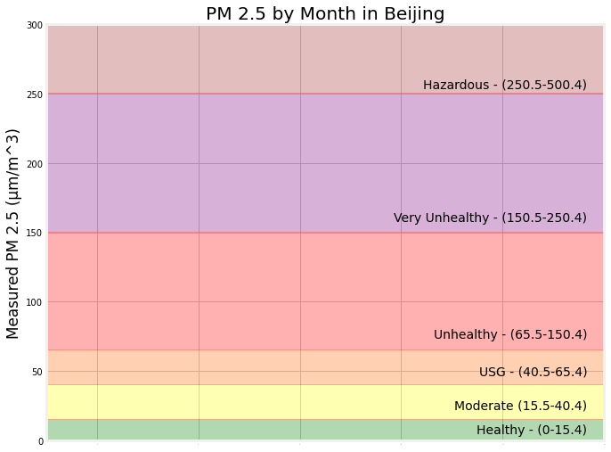
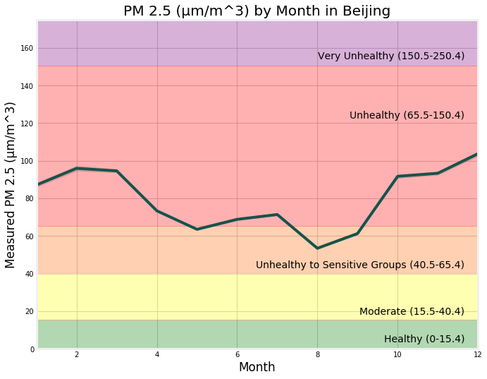
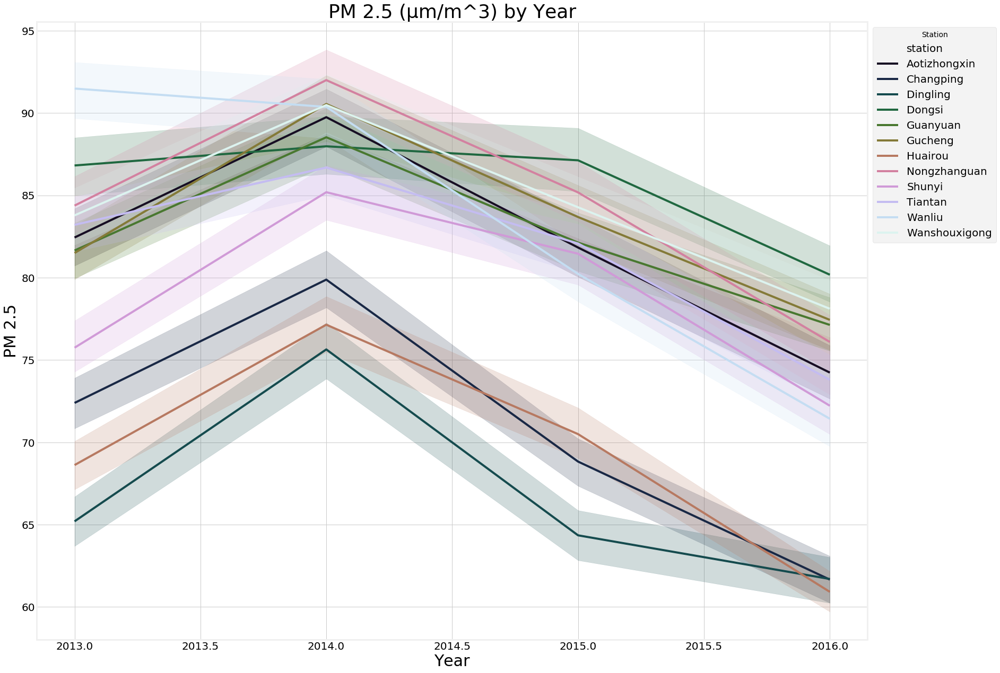
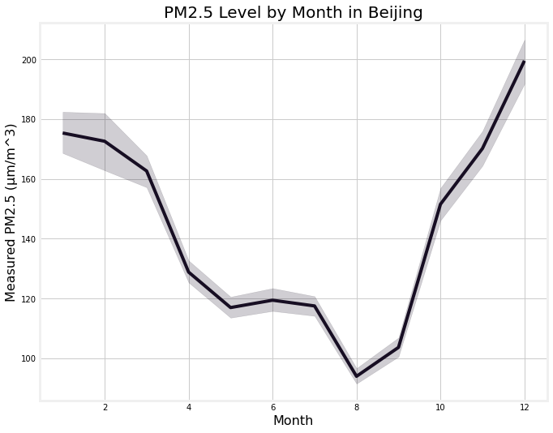
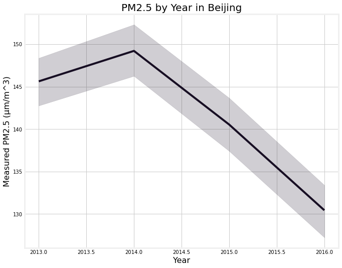
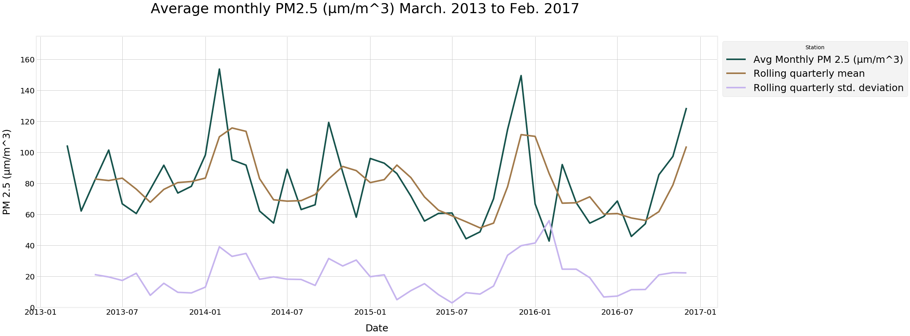
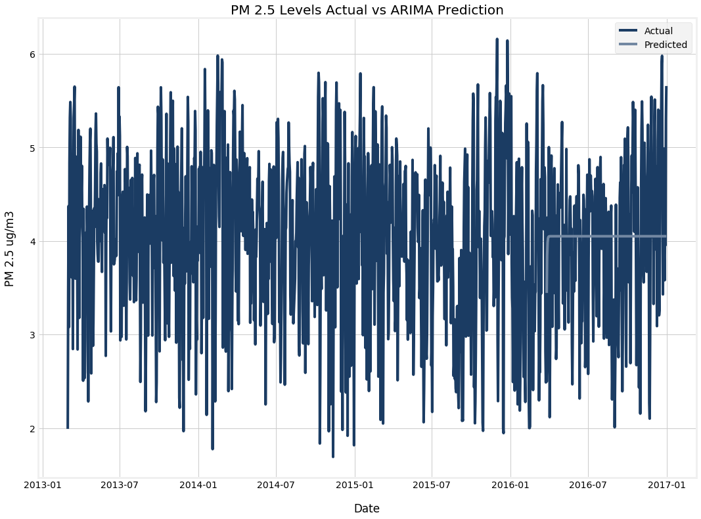

# Beijing Air Quality Time Series Model
### Mod 3 Project by Paul Torres and Dolci Sanders

This repository contains data collection, cleaning and analyses of air quality data of Beijing
from 2013-2017. We used the pollutant and weather data from twelve sites located in around Beijing's city center . 
We downloaded and curated data from the University of California - Irvine. The data set was provided by the authors of 
*'Cautionary Tales on Air-Quality Improvement in Beijing'* (2017), a paper published in *Proceedings of the Royal Society*.

# Project

For this project, we aim to analyze the sampled air out of the twelve testing sites in Beijing 
in order to identify key trends and predict the levels of **PM 2.5** (particulate matter with a circumference of 2.5 microns). 
This is small particulate matter that can be suspended
in the air for long periods of time before it enters the lungs. First, we moved to combine all of the twelve sites
into a single dataset –– visualizing each of the pollutants and weather phenomenons. 
Then we tested for stationarity, causality between the features, and whether there was correlation between the features and time periods throughout our dataset.
Next, we began to fit models in an effort to prepare our models to predict the last twenty percent of the data that we had set aside as a test case.   
We next decided to focus on a univariate time series forecast vs a multivariate time series forecast. The reason for the switch was that the hardware was unable to keep up with the amount of observations and features. So in order to 

# Structure of Repository
- PNG -- contains images created during EDA and those linked in README
- 001_Data_Cleaning.ipynb -- contains all processes that went into cleaning the time series
- 002_EDA.ipynb -- contains code that creates the visuals for the project
- 003_Modeling.ipynb -- contains case where we tested forecasting models against holdout data
- README.md

# Business Case
1. Marking a Target/Identifying Stakeholders
	- To whom does it matter if we can predict the amount of particulate matter in the air?
		1. **Residents of an Area**:  
		Will they be able to enjoy time outdoors?
		2. **People Who Suffer From Respiratory Illnesses**:  
		Will their conditions worsen?
		Do they have to worry about loved ones contracting the same illness if not already predisposed?
2. Understanding how different countries and regions may battle against the proliferation of particulate matter
	- Are some regions experiencing a rise in PM 2.5 while others are experiencing a decrese? 
3. Understanding the viability in different models
	- Is it better to use a neural network or the basic ARIMA? 
	- Does the best model do a good job of predicting the target levels? 

# Data
Before we dive deeper into the questions, here is some information on our data. 
1. The data is focused on 12 testing sites in and around Beijing's city center from 2013-New York State and Alabama in 2018.
2. The data here was downloaded from *The University of California - Irvine* Machine Learning Repository.
    - You can find the dataset and dictionary [here](https://archive.ics.uci.edu/ml/datasets/Beijing+Multi-Site+Air-Quality+Data).  

## Descriptive Statistics
Now we will briefly discuss what our dataset contains. 
1. PM 2.5: The target variable has ranges within which it can fall.  

2. Beijing's Own Average Level Falls High on the Scale.

3. Average PM 2.5 Levels at Each of the Twelve Stations.

# Process
With targeting particulate matter floating in the air, we explored how to better predict the target variable to make a 
better model for our stakeholders.

## Removing trends .

The data was capped at the last day of December 2016. While the data extended into 2017, it only covered the first two momnths and the predictions would have been affected if we allowed an entire year to be represented by the two coldest months of winter. For the purpose of this study, we have decided to work with the daily mean value of PM 2.5 vs the hourly reading. This was done to make a more strenuous deadline. While the data is numerous, the hardware cannot handle the large amount of observation (almost 500 thousand) and features. 

Doing each of the stations individually would not have been a cost effective project. So instead, we elected to aggregate the data from the twelve sites and forecast the city of Beijing as a whole. 

First, the breakdown of PM 2.5 on Monthly Averages for Beijing.
    

Secondly, the breakdown of PM 2.5 on Yearly Averages for Beijing.

Finally, the visual of the rolling summary statistics.

### Modeling

Using a continuous variable means that we want to use RMSE as our target metric. Our goal is to minimize RMSE because it is the count of our residuals and will help us determine where our predicted values fall around the actuals. 
 

We ran several models, including a dummy model that ran the average of the test set, the ARIMA Model, and the SARIMAX Model. 

The outcomes were similar but the Logistic Regression performed the best in terms of Precision. 

### Facebook Prophet Model Performance

Taking a look at the confusion matrix, we can see that it misclassified some people that had insurance as not having, which does not hurt the business case. However, it has a low amount of assuming someojne has health insurance.

### ARIMA MODEL Performance

The advantage to picking a model like Logistic Regression is that it can highly interpretable. Using this model allows us access to the coefficients that the model used in order to fit the data. 

# Conclusion
Our model, using our desired metrics, was fit to our data very well. It ran with a high precision score and allowed for high levels of interpretation. 

# Further Steps

If we had the time we would have liked to run further tests on datasets individually. Breaking down the data set by testing site would give us access to more accurate data. As it stands, the aggregated data yielded a pretty strong model. With a top RMSE score of 0.77 compared to the mean score of 3.955, the predicted values were not far off. that contain the same information as the Census data but for very different populations and places with different policies than New York. 

# Recommendations
1. The health insurance industry would be better served by a model that took a holistic look at the target audience
2. Use this modeling information to target areas where demographics that fit these features are clustered

